# 🏭 Annex — Supply Chain & Production
> [!info] The supply chain as a **graph**, not prose. **Suppliers are now first-class `supplier` nodes** (CR-02 applied 2026-06-29) — they `SUPPLIES`→ the production activities, so the chain that turns a supplier's part into the LEO broadband service ODT sells is fully traversable: tiered suppliers, single-source flags, and the supplier → activity → output → asset path. Every supplier, figure, and dependency is canon-cited from [[Canon & Figures Register]] and the existing risk register; this annex invents none. *(Workstream **W4**; target tier **L2** → **L3** with CR-02 supplier nodes.)*

## 1. Why this annex exists
A board recognises a company by its supply chain. ODT builds **80 LEO satellites** (8 polar planes, 550 km) at **~$3.4M/sat incl. launch**, programme budget **$273.5M** ([[Canon & Figures Register]]). That output depends on a handful of **tier-1 suppliers**, two of them **single-source** — exactly the kind of concentrated dependency the RIM exists to surface. This annex pins the supplier map to the graph so a scenario like [[BST-SC1 Supplier Build-Chain Intrusion (Supply Chain)|SC1]] (supplier intrusion) or [[BST-GP1 Export-Control & Launch Disruption (Geopolitical)|GP1]] (export-control / launch) has a real substrate to traverse, and so the RIM's **scope / blast-radius** views light up on the manufacturing assets.

> [!note] How the supply chain is modelled (schema-true)
> Since **CR-02 landed** (RIM aligned `schema.canonical.yaml`, 2026-06-29), suppliers are **first-class context nodes**. The chain is modelled four ways, all schema-aligned:
> 1. **`supplier` context nodes** — 8 nodes (SUP-01..08) carrying `tier` {Tier 1/2/3/Internal}, `criticality` {Critical/Important/Standard}, `single_source` {bool}, `country`, `lead_time`.
> 2. **`SUPPLIES`** edges — `supplier` —`SUPPLIES`→ `business_activity` (components → **BA-PROC**; launch → **BA-LAUNCH**), so supplier **blast-radius** traverses into the production chain.
> 3. **The production chain** — `business_perimeter` —`USES`→ `business_activity` —`PRODUCES`→ `functional_target` —`HOSTED_ON`→ `technical_perimeter`.
> 4. **`CONCERNS`** edges tying each supply-chain risk to the production asset it threatens, and **`SOURCED_FROM`** (risk → supplier) tying each supply-chain risk to its supplier node.
>
> *The `supply_chain` **risk subtype fields** (`supplier_tier`/`criticality_class`/`single_source` on ROM-01/02/03/04, ROL-01, SEC-02) are **kept, denormalised** — they describe the risk; the node is the entity (CR-02 §3 Q3, zero migration).*

## 2. The supplier map (tier-1 dependencies)
All names and sole/dual-source statements are canonical — from the risk register, [[Carlos Mendes (VP Manufacturing & Supply Chain)|Carlos Mendes]]'s sheet, [[Annex - Security Architecture]] §7, and Context v2.2.

| Input | Supplier(s) | Node | Tier | Criticality | Single-source? | Tracked by | Mitigation |
|---|---|---|---|---|---|---|---|
| **Ku/Ka-band RF transponders** | **Teledyne** | **SUP-01** | 1 | **Critical** | **Yes** (sole) | [[Bestiary Index\|ROM-01]] | **MIT-02** RF dual-source qualification (Airbus DS) — *on-going* |
| **Space-grade Li-ion batteries** | **Saft** (9–12 mo lead) | **SUP-02** | 1 | **Critical** | **Yes** (exclusive) | ROM-02 | *(no qualified alternate — gap)* |
| **Composite bus structures** | **Northrop Grumman** / **Spirit Aero** | SUP-03 / SUP-04 | 1 | Important | No (dual) | ROM-03 | MIT-17 ECSS product assurance |
| **Attitude control** | **Moog** / **Orbital ATK** | SUP-05 / SUP-06 | 1 | Important | No (dual, 2 global) | *(latent — no risk yet)* | — |
| **Launch** | **SpaceX** Falcon 9 / **Rocket Lab** Electron (+ **Axiom** future) | SUP-07 / SUP-08 | 1 | Important | No (multi) | [[Bestiary Index\|ROL-01]] | **MIT-01** multi-launcher strategy — *existing* |
| **AIT integration line** (internal) | ODT clean-room (Plant Director) | — (BA-MFG) | Internal | **Critical** | — (single line) | ROM-04 | MIT-17 / clean-room controls |
| **Managed security (SOC)** | MSSP | *(not yet a node)* | — | Important | — | SEC-01 (privileged remote access) | MIT-13 corporate SOC |

The **8 SUP-* nodes** `SUPPLIES`→ their consuming activity (components/battery/structure/attitude → **BA-PROC**; launch → **BA-LAUNCH**); each external supply-chain risk `SOURCED_FROM`→ its supplier (ROM-01→SUP-01, ROM-02→SUP-02, ROM-03→SUP-03, ROL-01→SUP-07, SEC-02→SUP-01, + incident HX-01→SUP-01). The **internal AIT line (ROM-04)** is `BA-MFG` itself, not a supplier node (CR-02 §8); **MSSP** and the future **Axiom** launcher are narrative-only for now.

**Two single-source choke points — Teledyne (RF) and Saft (batteries) — sit on the Phase-4 critical path.** Either failing halts the build. Teledyne is being de-risked by the **Airbus DS dual-source qualification** (MIT-02, on-going); Saft has **no qualified alternate** — a standing gap the supply-chain owner ([[Carlos Mendes (VP Manufacturing & Supply Chain)|Carlos Mendes]]) carries.

## 3. The production chain (graph)
`BP-LEO` **USES** five activities; each **PRODUCES** an output; each output is **HOSTED_ON** an asset. The flow turns supplier parts into the sold service:

```mermaid
flowchart LR
  subgraph SUP [Suppliers CR-02]
    S1[SUP-01 Teledyne\nsole-source]
    S2[SUP-02 Saft\nsole-source]
    S34[SUP-03/04 Northrop/Spirit]
    S56[SUP-05/06 Moog/Orbital ATK]
    S78[SUP-07/08 SpaceX/Rocket Lab]
  end
  subgraph BP-LEO [HORIZON-LEO perimeter]
    BA1[BA-PROC\nProcurement & qual.]
    BA2[BA-MFG\nManufacture & AIT]
    BA3[BA-LAUNCH\nLaunch & LEOP]
    BA4[BA-SVC\nOps & service]
    BA0[BA-01\nDesign]
  end
  S1 -->|SUPPLIES| BA1
  S2 -->|SUPPLIES| BA1
  S34 -->|SUPPLIES| BA1
  S56 -->|SUPPLIES| BA1
  S78 -->|SUPPLIES| BA3
  BA0 --> FT0[FT-01 design data] --> TPPLM[(TP-PLM\nTeamcenter, Toulouse)]
  BA1 --> FTc[FT-COMP qualified components] --> TPAIT[(TP-AIT\nAIT clean room)]
  BA2 --> FTs[FT-SAT integrated satellite] --> TPAIT
  BA3 --> FTk[FT-CONST on-orbit constellation] --> TPNOC[(TP-NOC\nDenver/Dublin)]
  BA4 --> FTv[FT-SVC LEO broadband service] --> TPNOC
```

**Supplier blast-radius (CR-02):** `(:supplier)-[:SUPPLIES]->(:business_activity)-[:PRODUCES]->(:functional_target)-[:HOSTED_ON]->(:technical_perimeter)` — e.g. *Teledyne (SUP-01) → BA-PROC → FT-COMP → TP-AIT*, so a Teledyne failure's reach to the AIT line is one traversal, and the `single_source: true` flag explains why ROM-01 is Critical.

**Read left to right:** Teledyne/Saft/Northrop-Spirit/Moog components (**FT-COMP**) are qualified by **BA-PROC** and received into the **AIT clean room (TP-AIT)**, where **BA-MFG** integrates and tests them to the Phase-4 gate (**FT-SAT**, ~$3.4M/unit). **BA-LAUNCH** flies units on SpaceX/Rocket Lab into the **deployed constellation (FT-CONST)**, commanded from the **NOC (TP-NOC, Denver/Dublin)**, where **BA-SVC** runs the **LEO broadband service (FT-SVC)** — the revenue-bearing output. The pre-existing design chain (**BA-01 → FT-01 → TP-PLM**) feeds the build with master design data.

> [!note] Schema limitation (honest)
> The schema expresses *perimeter uses activity / activity produces target / target hosted on asset* but **not** target→activity "feeds" sequencing. The left-to-right flow above is the narrative reading; the graph holds the four parallel activity→target→asset strands plus the assets they share (TP-AIT hosts components + satellites; TP-NOC hosts constellation + service).

## 4. Where the scenarios bite (risk ↔ chain)
Each supply-chain risk **`CONCERNS`** the production asset it threatens and (CR-02) **`SOURCED_FROM`** its supplier node, so the RIM's blast-radius traversal reaches the chain from both the asset and the supplier:

| Risk | Sourced from | Concerns | The bite |
|---|---|---|---|
| **ROM-01** Teledyne sole-source failure | SUP-01 Teledyne | TP-AIT | No transponders → integration stalls → Phase-4 slip. Cause of **GP1**. |
| **ROM-02** Saft delivery delay | SUP-02 Saft | TP-AIT | No qualified cells inside lead time → build gap. |
| **ROM-03** composite quality drift | SUP-03 Northrop Grumman | TP-AIT | Structural rework / scrap at integration. |
| **ROM-04** clean-room contamination | *(internal — BA-MFG)* | TP-AIT | AIT line halt + decontamination. |
| **SEC-02** firmware/hardware tampering | SUP-01 Teledyne | TP-AIT | Compromised components integrated → the **SC1** integrity crisis (certify-clean doubt). |
| **ROL-01** launch availability gap | SUP-07 SpaceX | TP-NOC | Manifest congestion → deployment slip. Cause of **GP1**. |

> [!tip] The Teledyne convergence (CR-02 §5.4 payoff): `SUP-01` is `SOURCED_FROM` by **ROM-01** (active sole-source risk), **SEC-02** (firmware-integrity risk) *and* **HX-01** (the past incident) — "show everything involving Teledyne" is now one traversal across active risks and history.

**The convergence read:** [[BST-SC1 Supplier Build-Chain Intrusion (Supply Chain)|SC1]] enters at the **PLM** (`OCCURS_AT` TP-PLM — supplier data exchange) and lands on the build chain; [[BST-GP1 Export-Control & Launch Disruption (Geopolitical)|GP1]] is *caused by* ROM-01 + ROL-01 (the RF + launch dependencies above). Both reach the IPO apex (TCO-04) through the risk graph — the supply chain is one of the six families draining into the financing crunch. See [[Bestiary Index]] and [[ODT Risk Status & Executive Decision Brief - 2026-06-28|the risk brief]].

## 5. How RIM reads this
- **Scope / Technical axis:** TP-AIT and TP-NOC are now selectable assets; the supply-chain risks and production outputs traverse from them.
- **Supplier concentration:** filter `supplier` nodes by `single_source: true` → the **Teledyne + Saft** choke points surface immediately; `criticality: Critical` on the node (and `criticality_class` on the risk) ranks the portfolio. `country` exposes geopolitical concentration (Saft = France; the rest US).
- **Supplier blast-radius (CR-02):** start from a `supplier` node and traverse `SUPPLIES`→activity→`PRODUCES`→target→`HOSTED_ON`→asset — "if Teledyne fails, which activities/outputs/assets stop?" is now a graph query, not an annex read.
- **Blast radius (Q-COV):** `CONCERNS` from six risks onto TP-AIT shows the manufacturing asset as a convergence point; `USES`/`PRODUCES`/`HOSTED_ON` give the production-chain path the demo can animate.
- **Owners:** the chain is borne across [[Carlos Mendes (VP Manufacturing & Supply Chain)|Carlos Mendes]] (procurement/manufacturing), Plant Director (AIT), Quality Manager (structures), [[Yuki Tanaka (VP Launch Operations)|Yuki Tanaka]] (launch), with the CISO on supply-chain integrity (SEC-02).

## 6. Open items / forward work
- **Saft single-source gap** — no qualified alternate battery supplier; a real decision candidate for the [[Annex - Risk & Opportunity Committee|ROC]] (qualify a second cell source vs. carry the dependency).
- ~~**First-class `supplier` node?**~~ **DONE — [[CR-02 - External Entities (Supplier & Regulatory)|CR-02]] APPLIED (2026-06-29).** RIM aligned `schema.canonical.yaml` with a `supplier` context node (tier/criticality/single_source/country/lead_time) + `SUPPLIES`→business_activity and `SOURCED_FROM` (risk→supplier) edges; ODT regenerated — 8 supplier nodes wired. Supplier-level traversal is live (§3–§5).
- **Build-rate figure** — Carlos's "~1 satellite/month" is a narrative target (cast sheet), not yet a canonical figure; elevate to canon only if a scenario needs the cadence quantified.
- **W6 overlap** — TP-NOC is added here as the ops/service host; **W6** will enrich it with the cyber kill-chain (attacker/entry/exploit) behind S1.

## Changelog
- 2026-06-29: **CR-02 applied — suppliers promoted to first-class nodes.** RIM landed `schema.canonical.yaml` (the secure canonical schema, replacing `schema.yaml`) with the `supplier` context node + `SUPPLIES`/`SOURCED_FROM` edges. Reframed §intro + §1 modelling note (no longer "RIM has no supplier type"); added node IDs (SUP-01..08) to the §2 map; added a supplier layer + blast-radius path to the §3 graph; added `SOURCED_FROM` + the Teledyne convergence to §4; added supplier-node read paths to §5; closed the §6 forward item. Subtype fields kept denormalised; ROM-04 stays internal (BA-MFG, no supplier node); MSSP + Axiom remain narrative-only. Seed regenerated (8 supplier nodes, 8 `SUPPLIES`, 6 `SOURCED_FROM`). No new canon figures.
- 2026-06-29: **Annex created (W4 — supply-chain graph, target L2).** Modelled the supplier map (tier/criticality/single-source on ROM-01/02/03/04, ROL-01, SEC-02) and built the production chain in the graph: 4 new `business_activity` (BA-PROC/MFG/LAUNCH/SVC) + 4 new `functional_target` (FT-COMP/SAT/CONST/SVC) + 2 new `technical_perimeter` (TP-AIT, TP-NOC), wired `BP-LEO`-USES→activity-PRODUCES→target-HOSTED_ON→asset (12 edges) and six `CONCERNS` (supply-chain risk → asset). All supplier names/figures canon-cited; no new canon figures. Seed regenerated (`demo_seed.cypher`, 4132 lines, 144 relationships). Wired into [[Sourcebook Index]]. Open: Saft second-source decision; possible future `supplier`-node CR; build-rate canonicalisation.
