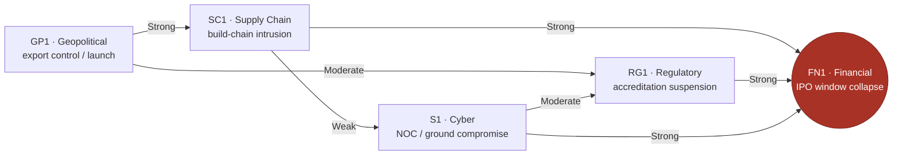

# 👹 Bestiary — Scenario & Threat Database

Each entry is a **priced feared-event** — a `SpiceScenario` family (three cases) attached to a Business Risk and assessed against a P&L perimeter. The bestiary is **multi-family and extensible**: cyber is just the first family.

## Families seeded
| Entry | Family | Illustrates | Cause | ≈ Realistic cost |
|---|---|---|---|---|
| [[BST-S1 NOC Ground Compromise (Cyber)|S1]] | Cyber | RH-04 / RC-01 | security | **$69M** |
| [[BST-SC1 Supplier Build-Chain Intrusion (Supply Chain)|SC1]] | Supply Chain | RH-02 | security (supply-chain) | $36M |
| [[BST-RG1 Accreditation Suspension (Regulatory)|RG1]] | Regulatory | RH-05 | other (regulatory) | $48M |
| [[BST-GP1 Export-Control & Launch Disruption (Geopolitical)|GP1]] | Geopolitical | RH-04 / RA-02 | geopolitical | $30M |
| [[BST-FN1 IPO Window Collapse (Financial)|FN1]] | Financial / IPO | RC-01 / RC-02 / RC-03 | other (financial) | dilution-priced |

## The interconnection — why this is a graph, not a list
> [!important] The thesis
> These are **not independent monsters.** Every family eventually **converges on the financing/IPO objective** ([[Canon & Figures Register|TCO-01]]). A flat register hides this; RIM surfaces it. This is the single most important thing the bestiary demonstrates.

*Edge labels are `INFLUENCES` strengths (weak 0.25 / moderate 0.5 / strong 0.75 / critical 1.0). Rendered full in [[Influence Map]].*

## How to add a family
Copy [[_Scenario Stat-Block Template]], fill the three cases, declare `illustrates` / `caused-by` / `assessed-against`, and — crucially — wire `influences` / `influenced-by` to existing entries. Tracked in [[SESSION-STATE]].
