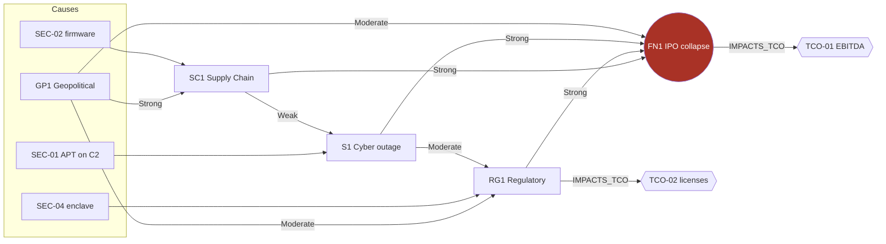

# 🗺️ Influence Map — how ODT's risks connect
> [!info] The cross-family causal network, the visible form of the RIM thesis. Edge labels are `INFLUENCES` strengths.

## Read it like this
Four **different causes** (a hacker, a supplier, a regulator, a geopolitical shift) propagate through different families and **converge on FN1 / TCO-01**. The mitigations worth most are the ones on shared edges — the **commonality view**. Full entries in [[Bestiary Index]].
